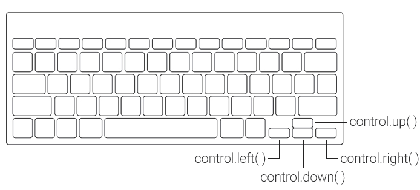

# burnout-keyboard-controls-plugin

> :video_game: Provide keyboard controls for [burnout game engine](https://github.com/burnoutjs/burnoutjs).



## Features

- Map the `up` key for burnout `control.up()`.
- Map the `down` key for burnout `control.down()`.
- Map the `left` key for burnout `control.left()`.
- Map the `right` key for burnout `control.right()`.

## How to use?

**Tip:** First, install and config [burnout.js](https://github.com/burnoutjs/burnoutjs) game engine.

### Install

```sh
$ yarn add burnout-keyboard-controls-plugin
```

### Setup

#### ES6/ECMAScript 2015 module:

**Tip:** Use [Webpack](https://webpack.github.io/) (or similar module bundler) to manage the components.

```js
import burnoutKeyboardControlsPlugin from 'burnout-keyboard-controls-plugin';
```

#### CommonJS module:

**Tip:** Use [Browserify](http://browserify.org/) (or similar module bundler) to manage the components.

```js
const burnoutKeyboardControlsPlugin = require('burnout-keyboard-controls-plugin');
```

##### Define your plugin

```js
// ...

burnout.defineControlsPlugin(burnoutKeyboardControlsPlugin);

// ...
```

<hr>

## Development

### Getting started

Clone this repository and install its dependencies:

```sh
$ git clone https://github.com/burnoutjs/burnout-keyboard-controls-plugin.git
$ cd burnout-keyboard-controls-plugin
$ yarn
```
### Build

Builds the library to dist:

```shev
$ yarn build
```

Builds the library, then keeps rebuilding it whenever the source files change using [rollup-watch](https://github.com/rollup/rollup-watch):

```sh
$ yarn dev
```

### Code Style

Follow the [JS Code Style Guide](https://github.com/afonsopacifer/code-style-guide/blob/master/js/JS.md) by [Afonso Pacifer](https://github.com/afonsopacifer).

*All code style are automatic validate with [ESLint](http://eslint.org/):*

### Tests

*Run all unit tests:*

```sh
$ yarn test
```

<hr>

## Versioning

To keep better organization of releases we follow the [Semantic Versioning 2.0.0](http://semver.org/) guidelines.

## Contributing

Want to contribute? [Follow these recommendations](https://github.com/burnoutjs/burnout-keyboard-controls-plugin/blob/master/CONTRIBUTING.md).

## History

See [Releases](https://github.com/burnoutjs/burnout-keyboard-controls-plugin/releases) for detailed changelog.

## License

[MIT License](https://github.com/burnoutjs/burnout-keyboard-controls-plugin/blob/master/LICENSE.md) © [Afonso Pacifer](https://github.com/afonsopacifer)
